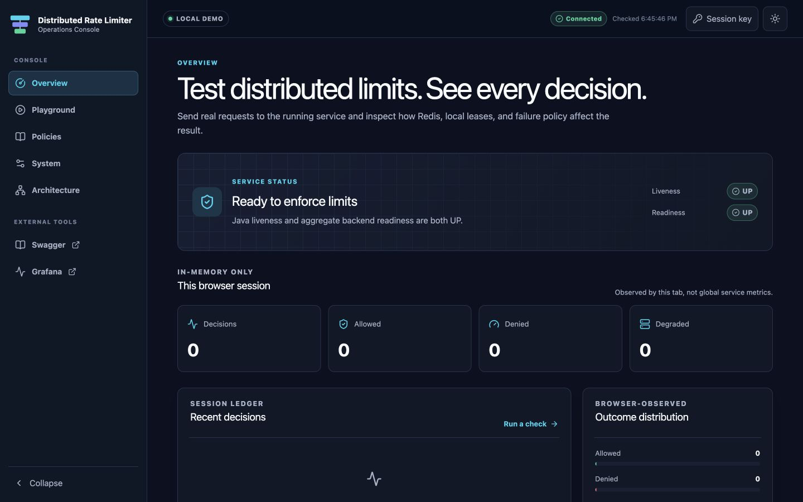
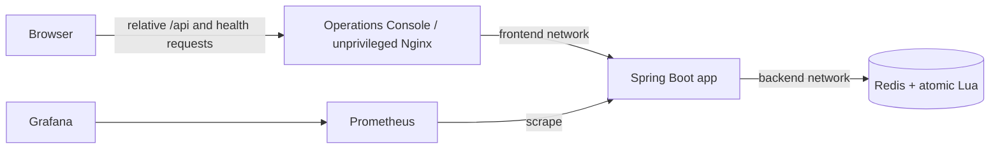
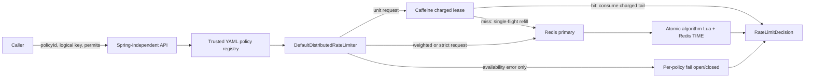

# Distributed Rate Limiter

[](https://github.com/balajik10/distributed-rate-limiter/actions/workflows/ci.yml)
[](LICENSE)

Distributed Rate Limiter is a Java 21 library, reusable Spring Boot starter, standalone HTTP service, and typed React operations console for enforcing and demonstrating per-policy, per-subject quotas across application instances. Redis Lua scripts own the linearizable read–decide–reserve transition; Redis server time removes application-clock skew from distributed decisions; and an optional Caffeine charge-ahead tier reduces hot-key Redis traffic without write-behind or uncharged normal admissions.

The Operations Console is a local developer, interview, and operations aid. It reads real policies, sends real non-idempotent acquisitions through a same-origin Nginx proxy, explains every outcome, and keeps decision history only in the current browser tab.



## Features

- Token bucket, exact sliding-window log, and approximate two-bucket sliding-window counter.
- Handwritten, integer-only Lua with one `TIME` call, monotonic last-seen time, bounded work, fixed results, and TTL on every state key.
- Spring-independent immutable public API in `rate-limiter-core`.
- Spring Boot auto-configuration, trusted YAML policies, Redis/Lettuce, Caffeine leases, Micrometer, and backend health in `rate-limiter-spring-boot-starter`.
- Synchronous Spring MVC service with stable status/header behavior, RFC 9457 errors, OpenAPI, API-key authentication, request correlation, and no raw logical key exposure.
- Per-policy `FAIL_OPEN` or `FAIL_CLOSED` behavior, including startup and operation while Redis is unavailable.
- React, strict TypeScript, Vite, and Tailwind Operations Console with Overview, Playground, Policies, System, and Architecture views.
- Safe bounded Demo Traffic Lab, truthful `200`/`429`/`503`/ambiguous-outcome handling, and zero automatic retry of permit-consuming requests.
- Hardened unprivileged Nginx with same-origin API proxying; Spring CORS remains disabled.
- Docker Compose demo, Prometheus/Grafana profile, deterministic failure demo, k6 harness, Testcontainers and browser tests, SBOM generation, and GitHub Actions.

## Prerequisites and one-command start

The Docker path needs Docker Engine/Desktop 24+ with Compose v2. Host scripts need Bash, `curl`, and `jq`. A host Maven build needs a Java 21 JDK; Maven itself is supplied by the 3.9.9 wrapper. Frontend development needs Node 24.20.0 and npm.

```bash
docker compose --profile observability up --build -d
docker compose --profile observability ps
curl --fail http://localhost:8080/actuator/health/readiness
curl --fail http://localhost:3001/healthz
```

The local demo deliberately starts without an `.env` file. Open the console at [http://localhost:3001/console](http://localhost:3001/console). The default profile starts Redis, the Spring app, and the UI; the command above also enables Prometheus and Grafana.

| Local endpoint | URL | What it is |
|---|---|---|
| Operations Console | [http://localhost:3001/console](http://localhost:3001/console) | Real browser UI through Nginx |
| UI health | [http://localhost:3001/healthz](http://localhost:3001/healthz) | Static server health, independent of Spring |
| Spring API | [http://localhost:8080](http://localhost:8080) | Direct backend origin for tools and clients |
| Swagger UI | [http://localhost:8080/swagger-ui/index.html](http://localhost:8080/swagger-ui/index.html) | Interactive API contract in the demo profile |
| OpenAPI | [http://localhost:8080/v3/api-docs](http://localhost:8080/v3/api-docs) | Live OpenAPI JSON |
| Readiness | [http://localhost:8080/actuator/health/readiness](http://localhost:8080/actuator/health/readiness) | Aggregate backend readiness |
| Prometheus | [http://localhost:9090](http://localhost:9090) | Metrics and PromQL |
| Grafana | [http://localhost:3000/d/distributed-rate-limiter/distributed-rate-limiter](http://localhost:3000/d/distributed-rate-limiter/distributed-rate-limiter) | Provisioned dashboard |

Stop only this scoped stack while preserving its data volumes:

```bash
docker compose --profile observability down --remove-orphans
```

Add `-v` only when you intentionally want to delete this Compose project's Redis, Prometheus, and Grafana data. Host ports are independently overridable with `REDIS_PORT`, `APP_PORT`, `UI_HOST_PORT`, `PROMETHEUS_PORT`, and `GRAFANA_PORT`; Compose builds browser-visible external links from those public port values.

## Two-minute demo

1. Open **Overview** and confirm the truthful liveness/readiness state and real policy snapshot.
2. In **Playground**, submit one fresh `api-standard` request and inspect status, source, remaining permits, headers, request ID, and client-observed latency.
3. Use a fresh `login-strict` key for six requests: the first five are allowed and the sixth is an expected upstream `429`, not an application failure.
4. Run the bounded **Demo Traffic Lab** and explain that its statistics belong only to this browser session; use k6 for load testing.
5. Open Grafana to correlate browser activity with server-wide metrics, then use **Architecture** to explain Lua atomicity, failure modes, and the lease bound.

The deterministic version, including Redis-outage recovery, is in [docs/DEMO.md](docs/DEMO.md).

## Build and test

```bash
./mvnw -B -ntp test
./mvnw -B -ntp -DskipITs verify
./mvnw -B -ntp clean verify       # includes Redis/Testcontainers integration tests
./mvnw -B -ntp install            # required before using the local starter from another project
```

Surefire `*Test` tests are Docker-free. Failsafe `*IT` tests own their Redis containers. The complete clean reactor reports the exact test and coverage results for the checked-out commit, and an aggregate build gate enforces at least 80% line coverage. Per-module JaCoCo reports are written to `target/site/jacoco/index.html`; the combined report is `rate-limiter-coverage/target/site/jacoco-aggregate/index.html`. CI uploads aggregate XML/HTML plus CycloneDX `target/bom.json`. The core build includes an Enforcer rule that rejects Spring, Redis, Lettuce, and Caffeine dependencies.

Frontend checks are intentionally independent of Maven:

```bash
cd rate-limiter-ui
npm ci
npm run format:check
npm run lint
npm run typecheck
npm run test:coverage
npm run build
npm run api:check
```

For local development, keep the Spring app on port 8080, run `npm run dev`, and open [http://localhost:5173/console](http://localhost:5173/console). Vite proxies only the required relative API and health paths. Run the full production-image E2E flow from the repository root with `./scripts/ui-e2e.sh`; it owns a uniquely named isolated Compose project and alternate ports.

## HTTP examples

`permits` defaults to one when omitted. Callers select a server-defined policy; they cannot submit capacities, windows, cache batches, or failure modes. Checks are intentionally non-idempotent: never blindly retry a timed-out call because Redis may already have charged it.

```bash
curl -i http://localhost:8080/api/v1/rate-limits/check \
  -H 'Content-Type: application/json' \
  -H 'X-Request-Id: readme-token-1' \
  -d '{"policyId":"api-standard","key":"user:123","permits":1}'

curl -i http://localhost:8080/api/v1/rate-limits/check \
  -H 'Content-Type: application/json' \
  -d '{"policyId":"login-strict","key":"account:alice","permits":1}'

curl -i http://localhost:8080/api/v1/rate-limits/check \
  -H 'Content-Type: application/json' \
  -d '{"policyId":"search-default","key":"tenant:acme","permits":1}'
```

The response never echoes `key`. Normal allows return 200, quota denials 429, unknown policies 404, invalid input 400, production authentication failures 401, and a fail-closed Redis outage 503. `X-RateLimit-*`, `Retry-After`, `X-Request-Id`, and `Cache-Control: no-store` are set where meaningful.

Read-only policy metadata and local tools:

```bash
curl http://localhost:8080/api/v1/policies | jq
./scripts/demo.sh
./scripts/demo-failure-modes.sh
./scripts/benchmark.sh --smoke
docker compose --profile observability up -d
```

- Operations Console: [http://localhost:3001/console](http://localhost:3001/console)
- OpenAPI JSON: [http://localhost:8080/v3/api-docs](http://localhost:8080/v3/api-docs)
- Swagger UI, non-production profiles: [http://localhost:8080/swagger-ui/index.html](http://localhost:8080/swagger-ui/index.html)
- Prometheus: [http://localhost:9090](http://localhost:9090)
- Grafana dashboard: [http://localhost:3000/d/distributed-rate-limiter/distributed-rate-limiter](http://localhost:3000/d/distributed-rate-limiter/distributed-rate-limiter) (`admin`/`admin` in the local default)

## Embedded Java API

Run `./mvnw install` in this repository first; version `1.0.0-SNAPSHOT` is local and is not claimed to be published to Maven Central. A Spring Boot 3.5.16 consumer adds `dev.ratelimiter:rate-limiter-spring-boot-starter:1.0.0-SNAPSHOT`, configures trusted policies, and injects the same API used by the HTTP service:

```java
import dev.ratelimiter.core.DistributedRateLimiter;
import dev.ratelimiter.core.RateLimitDecision;

final class SearchGateway {
  private final DistributedRateLimiter rateLimiter;

  SearchGateway(DistributedRateLimiter rateLimiter) {
    this.rateLimiter = rateLimiter;
  }

  boolean admit(String tenantId) {
    RateLimitDecision decision = rateLimiter.tryAcquire("search-default", tenantId);
    return decision.allowed();
  }
}
```

## Architecture



The browser sees only localhost origins. Nginx resolves `app` through Docker DNS, forwards response status/body/rate-limit headers without retrying, and exposes only `/api/**` plus the exact liveness/readiness endpoints needed by the console. The UI is not attached to the Redis backend network. CORS stays disabled because production browser calls are same-origin.



```mermaid
sequenceDiagram
    participant C as Caller
    participant L as Limiter JVM
    participant R as Redis/Lua
    C->>L: tryAcquire(policy, key, 1)
    alt valid local charged tail
      L-->>C: allow, source=LOCAL_LEASE
    else no tail
      Note over L: striped lock + mandatory cache recheck
      L->>R: minimum=1, desired=adaptive B
      Note over R: TIME, clean/refill, decide, reserve, expire atomically
      R-->>L: allowed, reserved g, remaining, deadlines
      Note over L: consume triggering permit; cache at most g-1
      L-->>C: source=REDIS
    else Redis availability failure
      L-->>C: configured FAIL_OPEN or FAIL_CLOSED
    end
```

The modules have one-way boundaries: `core` knows no framework; `starter` depends on core and owns infrastructure; `service` depends on both and owns HTTP security. See [Architecture](docs/ARCHITECTURE.md) for class and deployment views.

## Why Lua, Redis time, and hashed keys

A naive `GET` → calculate → `SET` lets two servers read the same balance, both allow, and overwrite each other. A transaction can help, but handwritten Lua keeps cleanup/refill, decision, multi-permit reservation, metadata, and expiry in one bounded atomic operation. Every script validates arguments and existing key types before its first write because a Lua runtime error does not roll back earlier writes.

Each script calls Redis `TIME` exactly once and uses `max(redisNowMs, storedLastMs)`. Application-node wall clocks therefore cannot refill or rotate the distributed state; Redis hosts still need time synchronization and alerts because a forward jump can expire/refill early and failover can expose a different clock.

The logical key never enters Redis, logs, metrics, errors, or responses. The full SHA-256—or HMAC-SHA-256 when a secret is configured—covers `policyId + "\0" + version + "\0" + logicalKey`. The digest is the Redis Cluster hash tag:

```text
rl:{digest}:tb
rl:{digest}:swl:events
rl:{digest}:swl:meta
rl:{digest}:swc
```

Changing a policy version or HMAC secret intentionally creates new state. Coordinate those changes across a deployment; rotate the HMAC secret blue/green to avoid two simultaneously valid budgets.

## Algorithm choice

| Algorithm | State and cost | Accuracy | Best fit | Principal limitation |
|---|---|---|---|---|
| Token bucket | Hash; O(1) | Exact rational refill at Redis reservation time | APIs that need a burst plus sustained rate | Does not enforce “at most L in every rolling window” |
| Sliding-window log | ZSET + metadata; O(g log n), cleanup O(log n + m) | Exact rolling window without a cached tail | Login, OTP, payments, strict abuse limits | O(live events) memory and burst cleanup can block a Redis shard |
| Sliding-window counter | Four-field hash; O(1) | Interpolated two-bucket model | High-throughput limits tolerant of approximation | Can approach 2L actual events in a true rolling window and can over-reject |

All scripts use integer arithmetic below `2^53 - 1`, exact positive ceiling division, bounded grants, one fixed seven-integer result shape, and semantic TTLs. Detailed invariants, retry/reset calculations, boundary conventions, and complexities are in [Algorithms](docs/ALGORITHMS.md).

## Charge-ahead Caffeine leasing

The local tier never allows and writes usage back later. Redis first charges a grant `g` where `requested <= g <= B`; the current request consumes its portion and only `g - requested` becomes a short local tail. One JVM can hold one live tail for a `(policy, version, algorithm, digest)`, refill is demand-driven and single-flight, weighted requests bypass leasing, expiry/crash/eviction never refunds, and deadlines use `System.nanoTime()` measured from just before the Redis call. Adaptive batches grow `1 → 2 → 4 → 8 → max` only when a prior lease is consumed rapidly.

Let `M` be actual live lease-holding application instances and `B` the maximum reservation batch:

```text
uncharged normal admissions = 0
cache timing discrepancy <= M × (B - 1)
sliding log admissions <= L + M × (B - 1)
token bucket admissions over T <= capacity + refillRate × T + M × (B - 1)
sliding counter admissions < 2L + M × (B - 1)
B <= floor(errorBudget / expectedMaxInstances) + 1
```

The configured instance count is a planning assumption, not runtime replica enforcement; the formula uses actual `M`. Fail-open traffic is excluded and can be unbounded. An ambiguous timeout may also both charge Redis and produce a fallback allow. Cross-boundary timing error is distinct from wasted quota: churn can cumulatively strand much more capacity, but cannot create uncharged normal admissions. See [Cache consistency](docs/CACHE_CONSISTENCY.md).

## Failure behavior

| State | Valid local charged tail | No local tail, `FAIL_OPEN` | No local tail, `FAIL_CLOSED` |
|---|---|---|---|
| Redis healthy | Consume tail, then reserve centrally | Central decision | Central decision |
| Redis connection/command timeout | Consume tail until its deadline | 200 degraded; remaining unknown | 503 degraded; remaining unknown |
| Lua/wrong type/malformed result/configuration bug | Never fallback | 500 | 500 |

Only Lettuce connection failures and command timeouts activate fallback. A timeout is ambiguous and is never retried automatically. Liveness remains up during a Redis outage; readiness becomes down. Use fail closed for authentication, OTP, payment, expensive writes, and abuse controls; use fail open only when temporary quota loss is safer than unavailability. See [Failure modes](docs/FAILURE_MODES.md).

## Scaling, fairness, and the hot-key ceiling

Ten application servers share one limit because every reservation for the same versioned digest executes atomically on the same Redis primary. That gives a global accounting order, not fair per-node scheduling: network timing and demand determine which node wins. Leases add a deliberately bounded temporal shift and may improve local latency while quota remains.

One exact logical key remains one Redis hash slot. Redis Cluster cannot split that state without weakening the guarantee, so 100k RPS to one key can saturate Lua CPU, network, the application, or that shard; sliding-log cleanup and memory are additional hazards. Honest options are a stronger/dedicated primary, a larger explicitly budgeted batch, a hierarchical approximate limiter, an edge limiter, or the O(1) token/counter models. The opt-in benchmark harness measures this; the project makes no unverified 100k-RPS claim.

Redis atomicity is primary-local, not cross-node durability. Restart, eviction, asynchronous replication loss, or failover state loss can reset a budget and over-admit. Use `noeviction`, private networking, ACL/TLS, persistence, replication, backups, latency/clock alerts, and a coarse ingress limit protecting the limiter itself.

## Metrics and operations

Bounded labels are policy ID, algorithm, outcome, source, failure mode, and sanitized error category—never logical key or request ID. Timers publish Prometheus histograms so p50/p95/p99 are calculable.

```text
ratelimiter.decisions                 ratelimiter.decision.duration
ratelimiter.redis.script.duration     ratelimiter.redis.calls
ratelimiter.redis.errors              ratelimiter.local.cache.hits
ratelimiter.local.cache.misses        ratelimiter.local.cache.reservations
ratelimiter.local.cache.evictions     ratelimiter.local.permits.reserved
ratelimiter.local.permits.consumed    ratelimiter.local.permits.wasted
ratelimiter.fallback.activations
```

The provisioned dashboard charts throughput, outcomes, decision/Redis p99, Redis errors per second, Redis calls per decision, cache-hit ratio, reservations, waste, and fallback activations. Alert explanations and incident procedures are in the [Runbook](docs/RUNBOOK.md).

## Security and limitations

The production profile refuses to start without both `RATE_LIMITER_API_KEY` and `RATE_LIMITER_KEY_HASH_SECRET`. API-key comparisons use fixed-length digests and constant-time comparison. Production protects `/api/v1/**`, Prometheus, and any enabled API docs; liveness/readiness remain available to orchestration. CORS is off, CSRF is disabled only for this stateless service-to-service API, body/input sizes are bounded, and secrets/raw keys are excluded from logs and metrics.

The console is local demo/operations tooling, not a public production control plane. An optional API key is held only in React memory and is never baked into Vite, Docker, or Nginx. Logical keys and decision history are not persisted. A public deployment would require HTTPS and a real authenticated reverse proxy/RBAC layer; a service-to-service API key in browser memory is not sufficient public-console security.

Version 1 deliberately excludes dynamic policy CRUD, caller-supplied limits, multi-region active-active guarantees, a full Cluster/Sentinel lab, reactive/gRPC/non-Java APIs, idempotency/deduplication, delayed queues, Kubernetes/Helm/Terraform, a public administration portal, lease refunds, and retries after ambiguous timeouts. Future work may add these without weakening the documented invariants.

## Documentation

- [Operations Console](docs/UI.md) · [Architecture](docs/ARCHITECTURE.md) · [Algorithms](docs/ALGORITHMS.md) · [Cache consistency](docs/CACHE_CONSISTENCY.md)
- [Failure modes](docs/FAILURE_MODES.md) · [Runbook](docs/RUNBOOK.md) · [Interview demo](docs/DEMO.md)
- [Benchmarks](docs/BENCHMARKS.md) · [Interview guide](docs/INTERVIEW_GUIDE.md) · [Resume bullets](docs/RESUME_BULLETS.md)
- [ADRs](docs/adr/) · [Security policy](SECURITY.md) · [Contributing](CONTRIBUTING.md)

Licensed under Apache-2.0.
