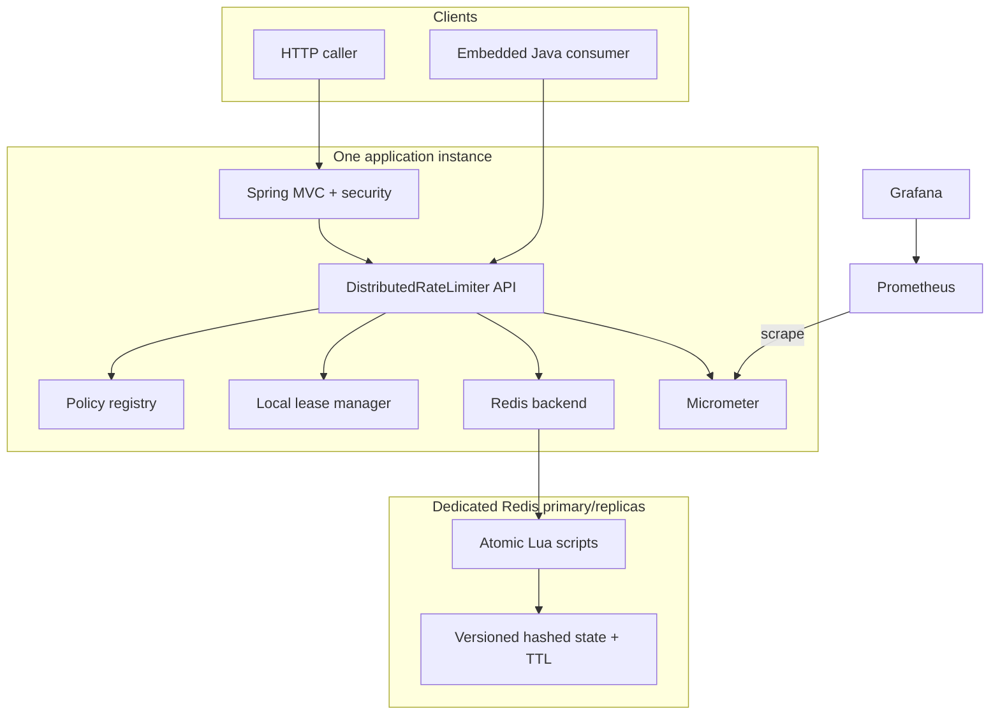
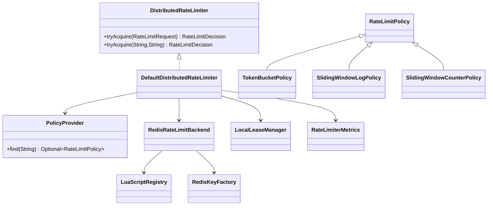
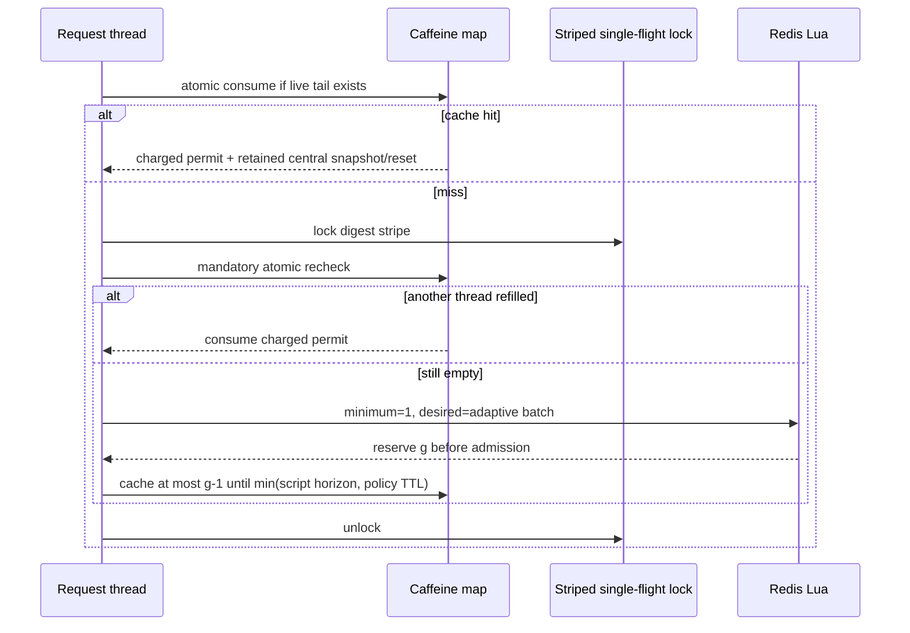

# Architecture

## Boundaries and deployment view

`rate-limiter-core` is the public contract: immutable requests/decisions, policies, validation, enums, and the `PolicyProvider` SPI. It has no framework, Redis, or cache dependency. `rate-limiter-spring-boot-starter` adapts trusted configuration into policies and owns hashing, Redis/Lua execution, lease coordination, fallback classification, health, and metrics. `rate-limiter-service` is one consumer of that starter; it owns HTTP, security, request correlation, Problem Details, and presentation mapping.



The default Compose stack uses a task-owned internal backend for service traffic and a separate task-owned bridge that makes loopback-only published ports work across Docker Engine versions. Production should use a dedicated private Redis deployment with ACL/TLS, `noeviction`, persistence, replication, backups, and latency/clock alerts.

## Class relationships



Concrete names may be combined when doing so removes an empty abstraction, but these ownership boundaries remain fixed. Auto-configuration uses constructor injection and backs off when a consumer provides its own `DistributedRateLimiter` or policy provider.

## Identity and Redis keys

Policy ID and version are trusted server configuration; the logical key is caller-derived and sensitive. The key digest is deterministic UTF-8:

```text
SHA-256(policyId || NUL || decimalPolicyVersion || NUL || logicalKey)
HMAC-SHA-256(secret, same bytes) when a secret is configured
```

The full lower-case hex digest becomes a Redis Cluster hash tag. `keyPrefix` defaults to `rl` and is honored for every algorithm:

```text
<prefix>:{<digest>}:tb
<prefix>:{<digest>}:swl:events
<prefix>:{<digest>}:swl:meta
<prefix>:{<digest>}:swc
```

All keys used by one script arrive through `KEYS`; Lua does not interpolate caller text. The two log keys therefore occupy the same cluster slot. Version changes reset state by design. HMAC-key rotation changes all digests and requires a coordinated blue/green cutover.

## Decision paths

### Strict/exact central path

Multi-permit requests, disabled leases, and batch size one call Redis with `minimumPermits == desiredPermits == requestedPermits`. The selected script validates keys and arguments, reads Redis time, clamps it against stored `last_ms`, updates state atomically, applies TTL, and returns one seven-integer tuple. Java validates that tuple before exposing a decision. Log and token-bucket decisions are central-exact; the counter is intrinsically approximate.

### Leased unit path



The cache key contains only policy ID, version, algorithm, and digest. Consumption is an atomic map operation that validates the monotonic deadline, so a thread cannot consume an expired/replaced lease retained in an old reference. There is no background prefetch, write-behind, or refund.

### Backend failure path

An already charged live tail remains usable. Without one, only classified Lettuce connection failures and command timeouts activate the selected policy's fallback. `FAIL_OPEN` allows an explicitly degraded request with unknown remaining/reset; `FAIL_CLOSED` denies as backend unavailable and the service maps it to 503. Wrong types, Lua errors, malformed result shapes, configuration defects, and serialization/programming errors propagate as internal failures and never silently fail open.

An acquisition timeout is ambiguous: Lua may have executed. The caller applies fallback without a blind Redis retry and never caches an unknown reservation. `NOSCRIPT` is different—the failed `EVALSHA` did not execute, so Spring Data Redis can perform its standard single `EVAL` fallback safely.

## Scaling, consistency, and clocks

Every exact subject maps to one Redis primary. Ten app servers obtain one global accounting order by invoking the same atomic state transition; no Java mutex participates across instances. This is not fair scheduling—network timing and demand decide which instance wins. A hot key cannot be sharded across primaries without changing the guarantee.

Lua is atomic on the executing primary, not durable consensus. Eviction, restart, failover to an asynchronously replicated node, or data loss can reset state. Redis server time removes application clock skew, while `effectiveNowMs = max(redisNowMs, storedLastMs)` prevents backward rotation/refill after a clock regression. A large forward server-clock jump remains operationally significant, so Redis NTP and clock alerts are required.

Strong multi-region active-active enforcement is excluded. A future design must choose between one authoritative region (latency/availability cost), region quotas (bounded but imperfect global use), or globally coordinated consensus (higher cost). It must not label independent regional counters as a global exact limit.

## Health and observability

Liveness contains only application liveness and stays up during Redis loss. Readiness includes readiness state plus backend health and goes down. Known YAML policies remain resolvable even when Redis was absent at startup, so configured fallback still works.

Metrics use bounded dimensions and publish histogram buckets for decision and script timers. Request IDs live in MDC and responses but never become metric labels. Structured events can include policy, algorithm, outcome, source, duration, and sanitized error category; they exclude logical keys, request bodies, credentials, and Redis errors that may carry sensitive context.
