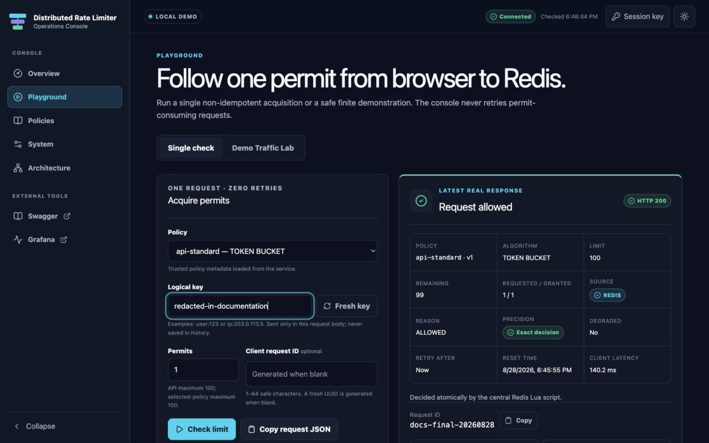

# Interview demo

This is a deterministic two-minute browser path followed by optional terminal proofs. It uses the real UI, Spring app, Redis, Prometheus, and Grafana; nothing in the production console is fixture-backed.

## Prepare

From the repository root:

```bash
export COMPOSE_PROJECT_NAME="rate-limiter-demo-$(date +%s)"
docker compose --profile observability up --build -d
docker compose --profile observability ps
curl --fail http://localhost:8080/actuator/health/readiness | jq
curl --fail http://localhost:3001/healthz
```

Open [http://localhost:3001/console](http://localhost:3001/console). The console health endpoint proves Nginx is serving; Spring readiness separately proves that backend checks currently pass.



## 0:00–0:20 — Overview

Show **Ready to enforce limits**, the real policy snapshot, and the empty **This browser session** counters.

Say:

> This is a local typed operations console. It calls the real service through same-origin Nginx, while Redis remains on a private backend network. Browser totals and latency describe only this tab; Grafana shows server-wide metrics.

## 0:20–0:45 — one real token-bucket decision

Choose **Run a rate-limit check**, select `api-standard`, generate a fresh demo key, and submit one permit.

Point out:

- HTTP `200`, allowed, algorithm `TOKEN_BUCKET`;
- immutable policy version, limit, remaining, retry/reset, and granted permits;
- `REDIS` or `LOCAL_LEASE` source and the exact/approximate explanation;
- preserved `X-RateLimit-*`, request ID, cache-control, and client-observed round-trip latency.

If the source is `REDIS`, explain that Lua performed one atomic transition. A later unit call may be `LOCAL_LEASE`: it spends a permit already charged centrally, never a write-behind allow.

## 0:45–1:10 — exact denial

In **Demo Traffic Lab**, apply **Strict login: 6 requests**, keep one fresh fixed key, and start the run. `login-strict` has an exact sliding-window log, a limit of five per 60 seconds, fail closed, and no local leasing.

The first five requests return `200`; request six returns the real upstream `429` JSON decision. Point out `LIMIT_EXCEEDED`, remaining zero, `Retry-After`, reset time, and the request ID. The lab continues through `429` because denial is the expected domain result and never automatically retries when the countdown reaches zero.

## 1:10–1:30 — bounded traffic and browser truth

Run a small `api-standard` or `search-default` preset. Show scheduled/completed counts, outcomes, sources, and browser p50/p95/p99.

Say:

> This is a functional browser demonstration capped at 200 requests, 20 requests per second, concurrency five, and 60 seconds. It is not a benchmark. The k6 harness is the performance tool.

Mention that **Stop run** prevents future scheduling but lets in-flight non-idempotent requests settle, because aborting them would make their outcomes ambiguous.

## 1:30–1:50 — Grafana correlation

Open [the provisioned Grafana dashboard](http://localhost:3000/d/distributed-rate-limiter/distributed-rate-limiter). Correlate the browser activity with server-wide decision throughput, allowed/denied outcomes, decision/script latency, Redis calls, cache hits, permit reservations/waste, and fallbacks.

Do not equate the browser's client latency with server latency or infer production capacity from this demo.

## 1:50–2:00 — close on correctness and limits

Open **Architecture** and summarize:

1. A server resolves a trusted read-only policy.
2. A valid local tail may satisfy an eligible unit request, but the permit was already charged in Redis.
3. Otherwise one handwritten Lua script uses Redis server time and atomically checks/reserves.
4. A timeout is ambiguous, so the acquisition is never blindly retried.
5. Per-policy fail open/closed selects availability posture.

For actual live lease-holding instances `M` and maximum batch `B`:

```text
cache timing discrepancy <= M * (B - 1)
```

Fail-open outage traffic and sliding-window-counter model error are outside that cache bound. One exact hot key still serializes on one Redis primary; global atomic accounting is not scheduling fairness.

## Optional terminal proofs

The deterministic API script uses unique keys, covers all three algorithms, and proves five strict allows followed by one `429`:

```bash
./scripts/demo.sh
```

The failure script stops only this Compose project's Redis, proves degraded fail-open `200`, fail-closed `503`, liveness/readiness separation, and recovery, then restores Redis in a trap:

```bash
./scripts/demo-failure-modes.sh
```

Run the bounded performance smoke only when you want to explain the separate k6 harness:

```bash
./scripts/benchmark.sh --smoke
```

## Stop without losing data

```bash
docker compose --profile observability down --remove-orphans
```

Add `-v` only when you intentionally want to delete this demo project's Redis, Prometheus, and Grafana volumes.
