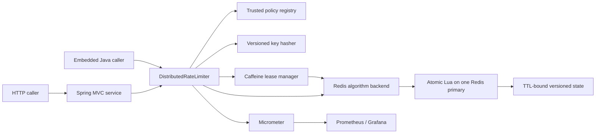

# Interview guide

This guide presents the design as implemented. The central distinction to keep clear in an interview is **Redis reservation time versus later local admission time**: normal permits are always charged centrally before use, but a short local lease can shift when an already charged permit is admitted.

## 60-second pitch

I built a Java 21 distributed rate limiter as a Maven multi-module project. The Spring-independent core exposes immutable request, decision, and policy types; a reusable Spring Boot starter supplies Redis, Caffeine, metrics, and health integration; and a Spring MVC service exposes the same limiter through a versioned HTTP API.

Each trusted YAML policy selects token bucket, exact sliding-window log, or approximate sliding-window counter behavior. A handwritten Lua script performs the complete read, time calculation, decision, reservation, update, and expiry atomically on Redis. Scripts use Redis server time and retain a last-seen timestamp, so application-node clock skew cannot create quota. Logical keys are represented only by versioned SHA-256 or HMAC-SHA-256 digests and Redis Cluster hash tags.

For hot unit-permit traffic, the optional Caffeine tier uses charge-ahead leasing: Redis charges a batch first, the triggering request consumes one permit, and the JVM may spend the short remaining tail locally. With `M` live lease holders and maximum batch `B`, cache timing error is bounded by `M(B-1)` while uncharged normal admissions remain zero. Redis outage behavior is selected per policy: availability-oriented APIs can fail open, while login and other abuse-sensitive operations fail closed.

## Five-minute explanation

### 1. Start with the contract

A caller supplies only `policyId`, logical key, and permits. Limits, algorithms, versions, cache bounds, and failure modes are trusted server configuration. The core module has no Spring, Redis, Lettuce, or Caffeine dependency, so an embedded consumer and the HTTP service use the same `DistributedRateLimiter` contract.

The policy version is part of state identity. A version change intentionally starts a new budget, which makes policy rollout explicit instead of attempting an unsafe in-place state migration.

### 2. Explain the central correctness path

The limiter resolves and validates the policy, hashes `(policyId, version, logicalKey)`, and selects one algorithm strategy. The strategy invokes one Lua script with `minimumPermits` and `desiredPermits`. Strict calls set both values to the requested amount. A successful script grants an integer between those bounds and atomically charges that entire reservation.

Lua matters because the transition is larger than a decrement. Token bucket refills fixed-point balance; sliding log removes expired events and inserts collision-free members; sliding counter rotates buckets and evaluates a weighted numerator. Each transition also calculates retry/reset information and applies TTLs. Splitting any of that into client-side reads and writes creates races.

Every script calls Redis `TIME` once and uses `effectiveNowMs = max(redisNowMs, storedLastMs)`. All calculations use integers below Lua's exact `2^53-1` range. The common seven-integer result is validated again at the Java boundary; malformed script results and wrong Redis types are programming/data errors, not reasons to fail open.

### 3. Compare the algorithms

- Token bucket is O(1), permits an intentional burst up to capacity, and enforces a burst-plus-refill envelope. It does not enforce a strict rolling window.
- Sliding-window log is exact in strict mode for `(now-W, now]`, but stores one event per reserved permit. Its memory and mass-expiry cleanup cost make it unsuitable for very large hot limits.
- Sliding-window counter is O(1) and interpolates the current and previous fixed buckets. That bounded state trades away exactness: actual events in a true rolling window can approach `2L`, and some distributions are over-rejected.

### 4. Explain the local tier without calling it an exact cache

For a unit request with leasing enabled, the JVM first atomically tries to consume a live Caffeine tail. On a miss, a bounded striped lock provides single-flight refill for that key, followed by a mandatory cache recheck. Redis then reserves an adaptive batch. The triggering request consumes one permit immediately and only `reservedPermits-1` may be cached.

The cache never writes usage behind and never refunds. The deadline is measured with a monotonic ticker from immediately before the Redis call and is capped by both policy lease TTL and the script's authorization horizon. Atomic map consumption prevents an old reference from spending an expired or replaced lease. Weighted requests bypass leasing.

This establishes two different facts: cumulative normal admissions never exceed cumulative Redis charges, and at most `M(B-1)` already charged permits can shift across a time boundary. `expectedMaxInstances` is only a planning assumption; the real formula uses actual live `M`. Fail-open traffic is outside the bound.

### 5. Close with failure and operational honesty

An already charged live lease remains usable during a Redis outage. With no lease, classified connection failures and command timeouts activate the selected policy's fallback. `FAIL_OPEN` returns an allowed, degraded decision with unknown remaining/reset; `FAIL_CLOSED` returns backend unavailable and maps to HTTP 503, not 429. Lua errors, wrong key types, malformed results, and serialization defects surface as internal errors.

The operation is intentionally non-idempotent. `NOSCRIPT` is a definite non-execution and permits the client's normal one-time `EVAL` fallback; a command timeout is ambiguous and must not be retried automatically. Liveness therefore remains up during Redis loss while readiness goes down. Metrics expose decisions, script calls/latency, cache use and waste, and fallback activation without labeling logical keys.

## High-level design



The deployment scales application instances horizontally, but a single logical subject always maps to one Redis Cluster slot and one primary. That is what preserves a global order for the subject—and what creates the honest hot-key ceiling.

## Low-level design

### Main responsibilities

| Component | Responsibility |
|---|---|
| `DefaultDistributedRateLimiter` | Resolve policy, validate request against it, hash identity, choose strict/leased path, and map fallback decisions |
| `YamlPolicyRegistry` / `PolicyFactory` | Bind trusted configuration and reject contradictory, unsafe, or out-of-range policies at startup |
| `LocalLeaseManager` | Atomic local consumption, striped single-flight refill, adaptive batches, monotonic expiry, and waste accounting |
| `RedisRateLimitBackend` | Select the algorithm and classify only availability failures for fallback |
| Algorithm strategies | Construct cluster-safe `KEYS` and typed integer arguments for one script |
| Lua scripts | Validate existing state, read server time, clean/refill/rotate, decide, reserve, persist, expire, and return a fixed result |
| `BackendDecision` | Reject a malformed seven-element result before it reaches public behavior |
| HTTP service | Validate transport input, map decisions to 200/429/503, attach headers/request IDs, and protect production routes |

### State and cost

| Algorithm | Redis state | Central cost | Central accuracy |
|---|---|---|---|
| Token bucket | Hash: `balance_units`, `last_ms` | O(1) | Exact fixed-point burst/refill model |
| Sliding log | ZSET events + hash metadata | O(g log n) insert; O(log n + expired) cleanup | Exact rolling window in strict mode |
| Sliding counter | Hash: current/previous counts, bucket start, last time | O(1) plus bounded retry search | Approximate two-bucket model |

### Decision sequence

```mermaid
sequenceDiagram
  participant R as Request
  participant D as Default limiter
  participant C as Local lease manager
  participant B as Redis backend
  participant L as Lua

  R->>D: policyId, logicalKey, permits
  D->>D: resolve policy, validate, hash key
  alt unit request and leasing enabled
    D->>C: acquireUnit(policy, digest)
    alt live charged tail
      C-->>D: LOCAL_LEASE allow
    else no live tail
      C->>C: striped lock + map recheck
      C->>B: reserve(minimum=1, desired=adaptive B)
      B->>L: one atomic script
      L-->>B: seven integers
      B-->>C: typed backend decision
      C->>C: consume trigger; cache at most g-1
      C-->>D: REDIS decision
    end
  else strict or weighted request
    D->>B: reserve(q, q)
    B->>L: one atomic script
    L-->>D: REDIS decision
  end
  D-->>R: stable RateLimitDecision
```

The result's public `grantedPermits` is the caller's grant; the larger internal `reservedPermits` never leaks into the API. Lease responses retain the central remaining snapshot and reset epoch. Their displayed remaining value is bounded by `min(limit, centralRemainingAtReservation + currentLocalTail)` and marked approximate whenever a tail exists.

## Cross-questions

### Token bucket versus both sliding-window algorithms—when does each fail?

Token bucket is the right fit for an API that tolerates a burst and wants a sustained refill rate. With capacity `C` and refill rate `r`, it enforces an envelope of roughly `C + rT` over interval `T`. It fails the requirement “never more than `L` in any rolling window”: saved tokens can be spent together, so a burst is a feature of the model, not a bug.

Sliding-window log is the strict choice. It records every reserved permit in `(now-W, now]`, so without a cached tail it gives exact rolling-window semantics and exact retry timing. It fails operationally at large hot limits: memory is O(live events), insertion is O(g log n), and removing a mass of simultaneously expired entries can block Redis's single command thread. Leasing also adds the separate, bounded `M(B-1)` admission-time shift.

Sliding-window counter is the bounded-memory choice. It keeps only current and previous fixed-bucket counts, so it is O(1), but interpolation assumes a distribution it did not observe. It can approach `2L` real events in a true rolling window and can also reject after the relevant real events have expired. It is unsuitable for a hard login/payment/OTP guarantee; use the log there. Caffeine's bound is additive and does not explain away the counter's intrinsic approximation.

### Why Lua? What exactly races in GET-then-SET?

Suppose a bucket has one permit. Server A and server B both `GET` the value before either writes. Both observe one, both allow, and both `SET` zero. Two callers were admitted although only one decrement survives. The same lost-update shape appears when two log callers both clean/count before adding, or two counter callers both rotate/read before incrementing.

The required transaction also includes server time, cleanup/refill/rotation, weighted reservation, retry/reset calculation, state write, and TTL. A plain `MULTI/EXEC` queues commands but cannot make an application-side decision from an earlier read. `WATCH` can implement optimistic retry, but a hot key produces conflicts, extra round trips, and complex retry semantics for a deliberately non-idempotent operation.

A bounded Lua script runs those steps as one atomic Redis command on the primary. The scripts validate argument ranges, key types, and stored shapes before their first write because a Lua runtime error does not roll back earlier writes. This atomicity is local to the executing primary; it is not replication durability or consensus.

### Redis is down—why fail open for one policy and closed for another?

Failure mode expresses business risk, not an infrastructure preference. For a general read API such as `api-standard`, temporary overuse may be less harmful than making the product unavailable, so `FAIL_OPEN` explicitly allows a degraded request. Remaining and reset are unknown, and outage traffic can be unbounded.

For `login-strict`, losing the limiter removes an abuse control. Availability is less important than preventing brute-force attempts, so `FAIL_CLOSED` returns backend unavailable and the HTTP layer uses 503. It is not a quota denial and therefore must not be mislabeled 429.

A live local lease is consumed first because that permit was already charged. Fallback is allowed only for classified connection failures and timeouts. Wrong types, Lua errors, malformed responses, and programming defects must fail visibly rather than silently turning into availability-oriented admission.

### How approximate is Caffeine, and under which invariants is the bound valid?

Let `M` be the actual number of live JVMs that can hold a lease for the same subject and `B` the maximum reservation batch. Redis charges the whole grant before any admission. The triggering request consumes at least one permit at that linearization point, leaving at most `B-1` permits on each JVM that can cross a later measurement boundary:

```text
uncharged normal admissions = 0
cache timing discrepancy <= M × (B - 1)
sliding-log admissions <= L + M × (B - 1)
token-bucket admissions over T <= C + refillRate×T + M × (B - 1)
sliding-counter admissions < 2L + M × (B - 1)
```

The bound requires one live lease per JVM/key, demand-driven refill, no prefetch, single-flight refill, charge before use, no refunds, atomic deadline-checked consumption, and a monotonic deadline capped by the Redis authorization horizon. Weighted requests bypass leasing. `expectedMaxInstances` only validates a design-time batch budget; if actual `M` is higher, the configured budget is no longer valid. Batch one or disabled caching gives zero cache timing error.

Fail-open traffic is excluded and may be unbounded. An ambiguous timeout followed by fail open may admit even if Redis charged. If measuring downstream execution rather than limiter decision time, use the more conservative `M×B` shift. Finally, timing shift is not waste: crashes and churn can cumulatively strand far more permits, causing underutilization without creating uncharged admissions.

### Why is sliding-window counter already approximate without Caffeine?

The counter knows only aggregate counts for two fixed buckets. At elapsed time `e` in the current bucket it estimates prior contribution as `previous × (W-e)/W`, effectively assuming the previous events were spread uniformly.

If `L` previous events actually arrived near the end of their fixed bucket, many remain inside the true rolling window even when interpolation has decayed most of their weight. The model can then admit almost another `L`, so actual events approach `2L`. In the opposite case, previous events occurred near the start and have already left the true window, but the weighted model still counts some of them and over-rejects. This error exists in strict, cache-disabled counter mode; local leasing adds only its separate `M(B-1)` time shift.

### How is one global limit enforced across ten app servers?

All ten servers derive the same versioned digest for the same `(policy, logicalKey)`. The digest's Redis hash tag maps every key for that subject to one cluster slot, and every reservation executes one atomic script on that slot's primary. Redis therefore supplies one serialization order across all application instances; no JVM mutex participates in global correctness.

With local leasing, the global order applies to reservations rather than every later unit decision. Each node can admit only its already charged tail, subject to the documented bound. During fail-open outage behavior, exact global enforcement is intentionally unavailable.

### Is global atomic enforcement the same as per-node scheduling fairness?

No. Atomicity answers “did total central reservations obey the algorithm?” It does not answer “did each node, caller, or region receive an equal share?” A low-latency or busier node may win more Redis linearization points, and a node holding a local tail may serve several requests before another node obtains capacity.

Fairness requires another policy layer: separate per-tenant keys, weighted quota allocation, an ordered queue, or regional/node sub-budgets. Those choices can reduce work conservation, add latency, or weaken the single exact global budget. This project deliberately guarantees accounting semantics, not scheduling fairness.

### What breaks for one hot key at 100k RPS?

One exact subject is one Redis hash slot and one primary. Redis Cluster can distribute many subjects, but it cannot split one subject's state without weakening the global guarantee. At 100k requests per second, the app connection path, network, Redis command CPU, and Lua execution queue can saturate. Sliding log is especially vulnerable because it stores live events and a mass expiry makes cleanup proportional to the expired group.

Leasing can move successful unit traffic toward roughly one Redis call per effective batch, but adaptive cold starts reduce that benefit, the batch is capped by an explicit error budget, and denied traffic still reaches Redis because there is no denial cache. Honest options are a stronger or dedicated primary, an explicitly larger bounded batch, the O(1) token/counter algorithms, hierarchical or edge limiting, or relaxing one exact global key into partitioned quotas. The repository includes a harness to measure this; it does not claim verified 100k-RPS capacity.

### How is application-node clock skew removed? What clock risks remain?

Production scripts never accept application wall-clock time. Each calls Redis `TIME` exactly once and computes integer milliseconds. The stored `last_ms` produces `effectiveNowMs = max(redisNowMs, storedLastMs)`, so a backward server-clock step or a failover to a behind clock cannot refill or rotate state backward. Local lease expiry uses a monotonic ticker, with the deadline measured from Redis call start rather than response arrival.

Redis time is still physical time, not a perfect logical clock. A large forward jump can refill, rotate, or expire state too early. A backward jump is clamped, which can temporarily freeze time-based progress until the clock catches up. Failover can change clock offset, and TTL behavior depends on Redis host time. Redis hosts therefore need time synchronization, offset alerts, and operational review after clock or failover incidents.

### What do EVALSHA, NOSCRIPT, and ambiguous timeouts mean?

`EVALSHA` asks Redis to run a cached script by its SHA-1 digest and avoids sending the body on every call. `NOSCRIPT` means that Redis definitely did not find or execute that digest, commonly after `SCRIPT FLUSH` or primary replacement. It is safe for Spring Data Redis to send the script body once with `EVAL` in that specific case.

A timeout is different: the client may have timed out before Redis received the command, while it was queued/running, or after Redis committed the reservation but before the reply arrived. Acquisition is non-idempotent, so retrying can charge twice. The implementation classifies command timeouts as ambiguous availability failures, performs no acquisition retry, caches no unknown tail, applies the policy fallback, and records a bounded error category. A fail-closed caller may be denied after a permit was consumed; a fail-open caller may be allowed even if Redis also charged it. Both are safer than an invisible double-execution retry.

### What happens when an app instance crashes with unused permits?

Those permits were already subtracted from central capacity, so the process simply loses them. They become usable again only through the algorithm's normal refill/window expiry or because all TTL-bound state eventually disappears. The system never refunds on crash, shutdown, eviction, expiry, or policy change because a refund can race a final local consumer and create double spend.

The consequence is temporary underutilization, not over-admission. A graceful cache removal can count wasted permits, but a hard process death cannot emit its final metric. Repeated churn may strand a large amount of quota over time—even severe or full underutilization—so cumulative waste is distinct from the instantaneous `M(B-1)` cross-boundary bound.

### What can Redis failover/replication loss do to limits?

Lua atomicity covers one primary's command execution; it does not make the write synchronously durable on every replica. If a primary acknowledges reservations that have not reached the promoted replica, failover restores older balances/counts. The apparent quota increases and the system can over-admit. Restart, persistence loss, eviction, and backup restore can have the same reset effect.

Fail closed helps only when unavailability is detected; it cannot detect a reachable but stale promoted state. Production mitigations are a dedicated private Redis deployment, `noeviction`, ACL/TLS, suitable persistence and replication, replica-lag and failover monitoring, backups with understood recovery semantics, and business-level defense in depth. Stronger write durability can trade latency and availability, but it is outside the atomic-script guarantee.

### Why are Redis keys hashed and hash-tagged?

Hashing keeps the raw logical key out of Redis keyspace, logs, errors, metrics, and responses; it also gives fixed-length, delimiter-safe identifiers. The digest covers policy ID, immutable version, and logical key, so policies and versions have isolated state. SHA-256 is available for development, while HMAC-SHA-256 is required in production so guessable subject identifiers cannot be tested against visible digests.

The full digest appears inside `{...}`. Redis Cluster hashes only that tag, so the sliding log's event and metadata keys are guaranteed to share a slot and can be touched by one multi-key script. The configurable prefix remains outside the tag. A policy-version or HMAC-secret change creates new state; an uncoordinated rolling change creates parallel budgets, so rollout must be coordinated and secret rotation should use a blue/green cutover.

### How would this evolve for multi-region enforcement?

First choose the consistency objective explicitly; independent regional counters are not an exact global limit. The main options are:

1. Route every reservation to one authoritative region. This preserves the current semantics but adds cross-region latency and makes partition behavior a fail-open/fail-closed decision.
2. Allocate fixed or dynamically leased regional sub-budgets from a global authority. This keeps the sum bounded and improves locality, but can strand capacity and shifts fairness/accuracy to allocation and lease horizons.
3. Use a globally consistent datastore or consensus service. This can preserve a single order but costs latency, availability during partitions, and operational complexity.
4. Use hierarchical edge/region limiters with an explicitly approximate global envelope. This scales best when the product accepts quantified overshoot.

A practical evolution would retain trusted versioned policies, make the regional allocation invariant as explicit as `M(B-1)`, and select stricter behavior for login/payment than for general reads. Because cross-region timeouts are common and acquisition is currently non-idempotent, any safe automatic retry design would also need a durable acquisition ID and deduplication protocol rather than simply replaying the command.

## Honest closing statement

The strongest claim is: while Redis-backed normal enforcement is operating, every admitted permit was charged centrally, and strict mode gives one primary-local atomic order. The design does not claim scheduling fairness, synchronous replication durability, exact counter semantics, unlimited hot-key scalability, bounded fail-open traffic, or strong active-active multi-region enforcement.
