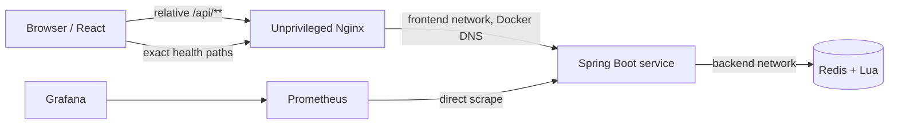

# Operations Console

The Distributed Rate Limiter Operations Console is a local developer, interview, and operations aid. It is not a policy administration portal or a public production control plane. Every production view is derived from the running Spring service or from requests completed in the current browser tab; fixtures exist only in tests.

## Routes and product scope

| Route | Screen | Purpose |
|---|---|---|
| `/console` | Overview | Liveness/readiness, real policy snapshot, current-tab totals, recent decisions, and quick actions |
| `/console/playground` | Playground | One real acquisition plus the bounded Demo Traffic Lab |
| `/console/policies` | Policies | Read-only trusted policy metadata and algorithm explanations |
| `/console/system` | System | Health truth, external tool links, and a safe Redis-outage guide |
| `/console/architecture` | Architecture | Interview-ready request flow, atomicity, leasing, approximation, failures, and hot-key limits |

`/` redirects to `/console`. Direct refreshes below `/console/**` use the Nginx SPA fallback. Unknown API or health requests never fall through to the SPA.

The console deliberately has no policy create/edit/delete controls, arbitrary caller-supplied limits, Redis key browser, quota-reset endpoint, Docker controls, embedded Grafana, background synchronization, or persistent decision history.

## Component and data flow



TanStack Query owns retryable idempotent reads. Acquisition mutations and Demo Traffic Lab calls use the native Fetch API with a finite timeout and no automatic retry. A focused in-memory session store retains at most 200 sanitized records and derives Overview totals, source distribution, and browser-observed latency percentiles. Records do not contain logical keys or credentials and disappear on reload.

Health polling runs every ten seconds only while the document is visible. The UI distinguishes liveness from readiness, network failure from a backend-reported state, and stale prior data from a fresh result. UI container `/healthz` proves only that Nginx can serve the console; it intentionally does not mirror Spring readiness.

## Same-origin proxy and network isolation

The production browser calls only its own origin, such as `http://localhost:3001/api/v1/policies`. Nginx proxies `/api/**` and exactly these health endpoints to `app:8080`:

```text
/actuator/health/liveness
/actuator/health/readiness
```

Nginx uses Docker DNS re-resolution so it can start while Spring is unavailable and recover after app recreation. It preserves request and rate-limit headers, upstream status, content type, and body. `proxy_next_upstream off` and `proxy_intercept_errors off` prevent proxy retries or conversion of `429`/`503` responses into UI HTML. Connect/send/read timeouts are bounded because a timed-out acquisition has an ambiguous outcome.

The UI container joins only the `frontend` network shared with the app. Redis remains on the separate `backend` network; the browser and UI container cannot contact it directly. Spring CORS stays disabled because browser calls are same-origin. Vite provides equivalent narrow development proxies to the default backend at `http://127.0.0.1:8080`.

The Nginx runtime is non-root, drops Linux capabilities, uses a read-only root filesystem with narrow temporary filesystems, sends `index.html` with `Cache-Control: no-store`, and gives hashed assets immutable caching. CSP, frame denial, content-type protection, Referrer Policy, Permissions Policy, and a small request-body limit apply without HSTS on local HTTP.

## API contract and generated types

The checked-in normalized contract is `rate-limiter-ui/openapi/openapi.json`. Generated raw TypeScript types live under `rate-limiter-ui/src/api/`; runtime Zod validation and an adapter turn them into deliberate UI view models. Malformed or internally inconsistent data is `PROTOCOL_ERROR`, never a fabricated valid decision.

```bash
cd rate-limiter-ui
npm run api:generate     # regenerate types from the checked-in snapshot
npm run api:check        # verify generated types without overwriting user files
npm run api:refresh      # deliberately refresh snapshot and types from a local app
npm run api:verify-live  # compare the checked-in snapshot with the running app
```

Set `OPENAPI_BASE_URL` to verify an app on a non-default port. A frontend production build needs no live backend.

## Decision and error mapping

| HTTP/result | Console classification | Traffic Lab behavior |
|---|---|---|
| `200`, allowed, not degraded | Normal allow | Continue |
| `429` with a valid decision | Quota denial | Continue; denial is the expected domain result |
| `200`, degraded, `FAIL_OPEN` | Allowed — degraded fail-open | Stop scheduling new calls |
| `503` with `FAIL_CLOSED` decision | Backend unavailable — blocked | Stop scheduling new calls |
| `400`, `401`, `403`, `404`, `413`, `500` | Sanitized problem/protocol/client/server error | Stop |
| `408`, `502`, `504`, gateway/network error, or timeout | Unknown outcome — do not retry blindly | Stop |

The validated JSON body is primary. Relevant `X-RateLimit-*`, `Retry-After`, `X-RateLimit-Source`, `X-Request-Id`, and `Cache-Control` headers remain visible. A disagreement between body and headers becomes a protocol warning. `remaining=-1`, `resetAtEpochMs=null`, and negative retry intervals render as unknown/unavailable instead of invented values.

An acquisition POST is non-idempotent: Redis may have committed after the browser or proxy timed out. React, TanStack Query, Nginx, Playwright helpers, and the traffic scheduler never replay it automatically. A countdown is informational only.

## Credentials and privacy

The real OpenAPI exposes optional `X-API-Key` service authentication for protected profiles. When used, the credential is held only in React memory, masked, cleared on reload, forwarded with its exact header name, and never placed in a URL, Vite variable, Docker argument, Nginx configuration, storage, history, logs, screenshots, or copied cURL. Nginx never injects a shared credential.

Logical keys are submitted only in request bodies. The console does not place them in routes, query parameters, recent-decision records, storage, analytics, or console logs. Nginx access logging excludes `/api/**`; standard application logging and metrics already exclude raw logical keys and request bodies. Theme is the only persistent browser preference.

A public deployment needs HTTPS plus real user authentication and authorization in front of the console. A service-to-service API key entered into a browser does not turn this local tool into a secure public administration system.

## Demo Traffic Lab safety bounds

The lab is a functional demonstration, not a performance benchmark. It is bounded to 1–200 requests, 1–20 requests/second, concurrency 1–5, and an estimated duration of at most 60 seconds. Only one run may be active. Fixed-key mode demonstrates shared quota; unique-key mode is explicitly labeled as independent quota state.

Each submitted POST receives a fresh request ID and stable client sequence number. Submission and completion order are tracked separately. **Stop run** cancels future scheduling but allows already-sent requests to settle; aborting them would create artificial ambiguous outcomes. Only the finite request timeout may abort an in-flight request, which is then classified `UNKNOWN_OUTCOME` and is never retried.

Use `./scripts/benchmark.sh` and the documented k6 scenarios for performance experiments. Do not infer global throughput, server latency, or production capacity from current-tab browser data.

## Accessibility and responsive behavior

The console targets WCAG 2.2 AA with semantic landmarks, one page heading, a skip link, associated form errors, visible focus, keyboard-operable navigation/forms/tabs/details, restrained live regions, and icon-plus-text status. The mobile drawer traps focus, closes with Escape, and restores focus. Tables have captions and responsive card alternatives; charts have adjacent numeric summaries.

Motion respects `prefers-reduced-motion`. The verified layouts target `1440×900`, `768×1024`, and `390×844` down to 360 px without page-level horizontal overflow.

## Development, testing, and production image

```bash
cd rate-limiter-ui
npm ci
npm run dev              # http://localhost:5173/console
npm run format:check
npm run lint
npm run typecheck
npm run test:coverage
npm run build
npm run api:check
```

Unit/component tests use Vitest, React Testing Library, user-event, jest-dom, axe, and MSW with unhandled requests treated as failures. Real E2E uses Playwright Chromium and axe against the final Nginx image, real Spring app, and real Redis:

```bash
cd ..
./scripts/ui-e2e.sh
```

The E2E runner uses a unique verified Compose project and alternate ports, first proves the unprofiled Redis/app/UI stack, then adds Prometheus/Grafana, verifies the live OpenAPI contract, exercises real proxy responses and outages, and tears down only its own resources. It does not retain traces, video, HAR, credentials, or raw acquisition bodies.

The normal local stack starts all five services with:

```bash
docker compose --profile observability up --build -d
```

Public external-tool ports are compile-time, non-secret build arguments derived from Compose's `APP_PORT`, `PROMETHEUS_PORT`, and `GRAFANA_PORT` overrides. Runtime credentials are never build arguments.
